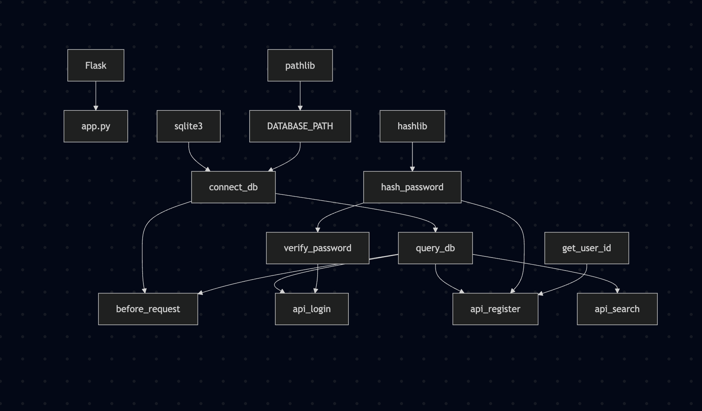
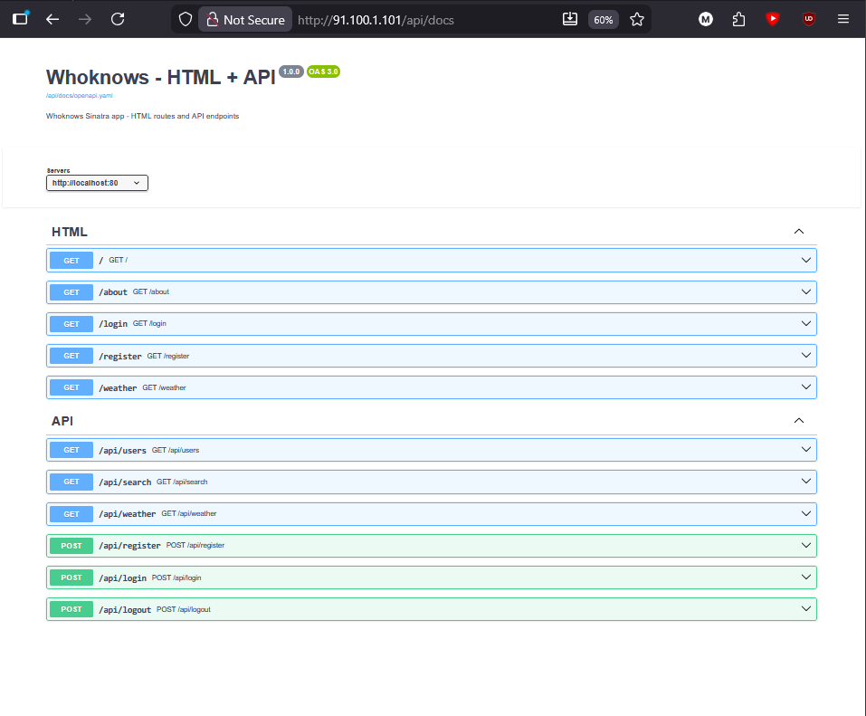

# Mandatory 1 - ripmarkus


### Kristian, Valdemar, Niko & Mathias

---

This is a mandatory hand-in for the Computer Science elective DevOps on EK.


_This is a collection of documentation, that reflects the state of the project on 13/03/2026. Refer to the repository documentation for the latest updates._

Use the links below to navigate to the relevant section.

- [Dependency Graph](#dependency-graph)
- [Problems With Legacy Codebase](#problems-with-legacy-codebase)
- [Our OpenAPI](#our-openapi)
- [Branching Strategy](#branching-strategy)

***

# Dependency Graph

As part of the elective, we were asked to generate a dependency graph to map out the legacy codebase and the dependencies it relies on.

## How we did it

We used [Mermaid](https://mermaid.js.org/) to generate a diagram, we used the code below:

```
graph TD
    flask[Flask] --> app[app.py]
    sqlite3[sqlite3] --> connect_db
    hashlib[hashlib] --> hash_password
    pathlib[pathlib] --> DATABASE_PATH

    DATABASE_PATH --> connect_db
    connect_db --> query_db
    connect_db --> before_request
    query_db --> before_request
    query_db --> api_login
    query_db --> api_register
    query_db --> api_search
    hash_password --> verify_password
    verify_password --> api_login
    hash_password --> api_register
    get_user_id --> api_register
```

## Value

Working with a dependency graph has not proved very useful for our group. We don't disagree with the concept, quite the contrary, it can be great for complex systems, where onboarding proves to be difficult, partly because of how massive some systems can be.

## !Lean

_However_, with a legacy codebase this simple, it feels like a frictional, even bureaucratic type of task — something that feels like it belongs in heavier development frameworks and doesn't feel in line with **Lean** in CALMS, at the current state of development.

On top of this, it introduces technical debt by forcing us to learn a toolchain for generating graphs, especially from a codebase written in a language we have never worked with, let alone an old deprecated version of it.

## Conclusion

It adds unnecessary overhead and doesn't provide us with clear functional value, time we'd rather spend on properly converting from Python2 to Ruby and making sure our new codebase is at its best.



# Problems With Legacy Codebase

## Converting from Python2 -> Python3
We used the `2to3` module (installed via pip) to ensure Python 3 compatibility across the application.

## Making the database path work no matter the machine (Relative)
To ensure the database works regardless of the machine's file system, we implemented relative paths using the `pathlib` module.
```python
DATABASE_PATH = Path(__file__).resolve().parent.parent / "schema.sql"
```

## API Routes
The app mixed page routes and API routes without clear separation. For example, `/login` renders a page while `/api/login` handles the form submission, but there was no consistent structure enforcing this.
```python
@app.route('/login')
def login():
    """Displays the login page."""
    if g.user:
        return redirect(url_for('search'))
    return render_template('login.html')

@app.route('/api/login', methods=['POST'])
def api_login():
    """Logs the user in."""
    ...
```

## SQL Injection Vulnerabilities
Almost every query in the app is vulnerable to SQL injection because user input is pasted directly into the query string using % formatting. A user could type something like `' OR '1'='1` and mess with the query entirely.
```python
g.user = query_db("SELECT * FROM users WHERE id = '%s'" % session['user_id'], one=True)
search_results = query_db("SELECT * FROM pages WHERE language = '%s' AND content LIKE '%%%s%%'" % (language, q))
g.db.execute("INSERT INTO users (username, email, password) values ('%s', '%s', '%s')" % 
             (request.form['username'], request.form['email'], hash_password(request.form['password'])))
```

## Password Safety
The python app used MD5 hashing, which is not that secure for passwords, since it is cryptographically broken and easy to crack with an online tool like https://crackstation.net. It should be using bcrypt, which we will implement in the ruby code.
```python
def hash_password(password):
    """Hash a password using md5 encryption."""
    password_bytes = password.encode('utf-8')
    hash_object = hashlib.md5(password_bytes)
    password_hash = hash_object.hexdigest()
    return password_hash
```

## Hardcoded Secret Key
The `SECRET_KEY` is set to `'development key'` right in the source code. This key is used to sign session cookies, so anyone who sees the code can forge them. It should be set via an environment variable, so nobody but us can access it.
```python
SECRET_KEY = 'development key'
app.secret_key = SECRET_KEY
```

## Debug Mode
The debug mode is hardcoded to false instead of set up in environmental variables, which requires the programmer to manually edit the source file and may accidentally commit the change to production and expose app info.
```python
DEBUG = False
app.run(host="0.0.0.0", port=8080, debug=DEBUG)
```

---

# Our OpenAPI
## Purpose
We want all developers to have a clear overview of our API and page endpoints, so we have an overview on the site itself.

The route /api/docs is an on premise Swagger/OpenAPI UI. The purpose it serves is to interact with the API directly from our browsers, and to test all of our endpoints.



## Generation
The OpenAPI specification was generated using Postman. All of our routes were added to a Postman collection. Examples were also added for almost every possible endpoint. The OpenAPI specification was generated shortly after this, using the `Generate Specification` feature. 

Postman can generate specifications in two different outputs, one being YAML and the other being JSON. YAML is easier for humans to read, which lead us to the conclusion of using YAML.

## HTML Routes
The specification also documents routes used for rendering pages in the browser:

- `/` – Main page. Supports the parameters `query` and `language`.
- `/about` – Page containing information about the project.
- `/login` – Page used for user login.
- `/register` – Page used for creating a new account.
- `/weather` – Displays weather data based on `city` and `country`.

## API Endpoints
The API routes are defined under the `/api` path.

- `GET /api/users` – Returns user data.
- `GET /api/search` – Performs a search based on `query` and `language`.
- `GET /api/weather` – Returns weather information for a specified location.

## Authentication Endpoints
User authentication is handled through the following endpoints:

- `POST /api/register` – Registers a new user.
- `POST /api/login` – Authenticates a user.
- `POST /api/logout` – Ends the user session.

## OpenAPI Specification

```yaml
openapi: 3.0.0
info:
  title: Whoknows - HTML + API
  version: 1.0.0
  description: Whoknows Sinatra app - HTML routes and API endpoints
servers:
  - url: http://localhost:80
paths:
  /:
    get:
      summary: GET /
      parameters:
        - name: query
          in: query
          schema:
            type: string
          example: test
        - name: language
          in: query
          schema:
            type: string
          example: en
      responses:
        default:
          description: GET /
      tags:
        - HTML
  /about:
    get:
      summary: GET /about
      responses: {}
      tags:
        - HTML
  /login:
    get:
      summary: GET /login
      responses: {}
      tags:
        - HTML
  /register:
    get:
      summary: GET /register
      responses: {}
      tags:
        - HTML
  /weather:
    get:
      summary: GET /weather
      parameters:
        - name: city
          in: query
          schema:
            type: string
          example: København
        - name: country
          in: query
          schema:
            type: string
          example: DK
      responses:
        default:
          description: GET /weather
      tags:
        - HTML
  /api/users:
    get:
      summary: GET /api/users
      responses: {}
      tags:
        - API
  /api/search:
    get:
      summary: GET /api/search
      parameters:
        - name: query
          in: query
          schema:
            type: string
          example: test
        - name: language
          in: query
          schema:
            type: string
          example: en
      responses:
        default:
          description: GET /api/search
      tags:
        - API
  /api/weather:
    get:
      summary: GET /api/weather
      parameters:
        - name: city
          in: query
          schema:
            type: string
          example: København
        - name: country
          in: query
          schema:
            type: string
          example: DK
      responses:
        default:
          description: GET /api/weather
      tags:
        - API
  /api/register:
    post:
      summary: POST /api/register
      responses:
        default:
          description: POST /api/register
      tags:
        - API
  /api/login:
    post:
      summary: POST /api/login
      responses:
        default:
          description: POST /api/login
      tags:
        - API
  /api/logout:
    post:
      summary: POST /api/logout
      responses: {}
      tags:
        - API
 ```


---

# Branching Strategy

## Github Flow

We chose this, because of how fast and lightweight it is, seeing that we want to be able to deploy fast and often.

Looking forward, we can change strategy to something more structured as our codebase scales. It wouldn't be a good fit if we were working in more/larger teams, or needed to maintain multiple released versions of the product at the same time. 

### Repository Structure

- `main`: Always stable and production-ready
- `feat/*`, `fix/*`, `documentation/*`, `chore/*`: Short-lived branches created from `main`, used for features, fixes, documentation or chores
- Pull Requests (PRs): Always required before being able to merge into `main`

All new features, bug fixes, and documentation updates are developed in separate feature branches and merged back into `main` via PRs.

---

## Enforcement of the Strategy

We enforce our branching strategy by not allowing direct pushes to `main` and developers cannot review or approve their own PR.

So the only way we can approve a merge is by having another team member approve the PR. Feature branches have to be deleted after the fact.

By preventing self-review, all code changes are validated by another team member. It increases accountability and collaboration among the team, ensuring a better understanding all together of the code, which is in alignment with C and S in CALMS.

---

## Why We Chose GitHub Flow

We chose GitHub Flow mainly because it is an easy start and doesn't require much setup or rules from the get-go. 

Seeing as we are a small team, and will continue to be so, it has been a great fit from the beginning. 

Should we get new team member(s), onboarding will be quite easy, since it is a very easy way of working and learning.

## It sounds like Trunk-Based Development

Sure, but there is a difference. We keep a strong emphasis on PRs as core part of the process and a big part of learning internally and knowledge sharing - but we do keep a higher tolerance for mistakes, this is an elective after all, and part of the learning process is making mistakes - sometimes a lot.

## Why not Git Flow?

For our small team and frankly very small codebase, it was too complicated - for now at least. When it is in production and we have a higher sense of Quality Assurance, there might be an argument in changing to this strategy, in order to schedule releases and work with more complex versioning.

## 3. Advantages and Disadvantages

### Advantages

Mandatory code reviews ensure that all changes are validated before reaching main, which improves overall code quality. The workflow itself is simple and easy to follow, and the structured use of branches results in a readable and organized Git history. Knowledge sharing increases naturally as team members review each other's work, and the risk of breaking main is reduced by never committing directly to it.

### Disadvantages

PRs can become a bottleneck if reviewers are unavailable or slow to respond, which may slow down development. The workflow also requires discipline from each team member to keep branches small and focused. Overall, the effectiveness of the strategy heavily depends on the team's responsiveness and engagement.