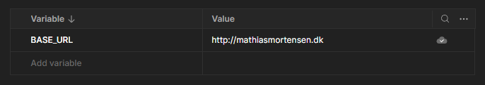
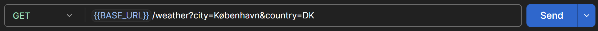
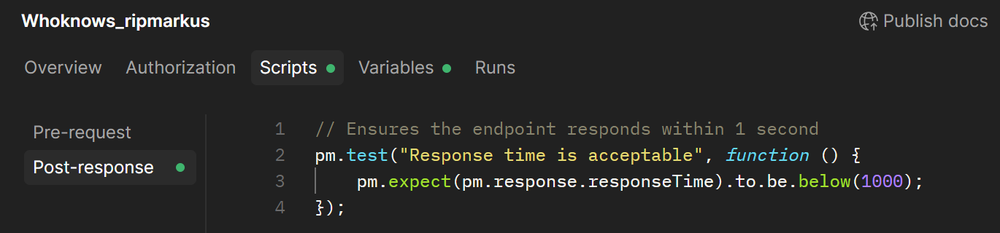

# API Monitoring

## Purpose

To ensure the application continues running after deployment, we have set up automated monitoring using **Postman Monitoring**.

The monitor periodically sends requests to the deployed application and runs tests on the responses. This allows us to detect problems early if something stops working.

The monitor helps verify:

- If endpoints are reachable
- If the API returns the expected response format
- If responses arrive within a reasonable time
- If routes accidentally break after changes
- If the API correctly handles both valid and invalid requests

---

## Monitoring Schedule

The Postman monitor is configured to run **every 3 hours**.

Each run executes the full request collection and records:

- Response status codes
- Response times
- Test results
- Any failures

---

## Monitored Endpoints

The monitor currently checks the following endpoints:

| Endpoint | Method | Purpose |
|--------|--------|--------|
| `/` | GET | Verifies that the frontpage is reachable and returns a valid HTML document |
| `/about` | GET | Verifies that the about page is reachable and returns a valid HTML document |
| `/login` | GET | Verifies that the login page is reachable and returns a valid HTML document |
| `/register` | GET | Verifies that the register page is reachable and returns a valid HTML document |
| `/weather` | GET | Verifies that the weather page is reachable and returns a valid HTML document |
| `/api/users` | GET | Verifies that the users API responds successfully |
| `/api/search` | GET | Verifies that the search API responds successfully |
| `/api/weather` | GET | Verifies that the weather API returns valid JSON data containing location information |
| `/api/register` | POST | Verifies that the registration endpoint correctly rejects invalid input (e.g. missing data) |
| `/api/login` | POST | Verifies that the login endpoint correctly rejects requests without valid credentials |
| `/api/logout` | POST | Verifies that the logout endpoint responds correctly |

---

## Collection Configuration + Shared Tests

### Base URL Variable

To avoid repeating the domain in every request, we use a **collection variable**.

This makes it easy to change the deployment URL without modifying every endpoint.

Requests are then written like this using the variable:

---

### Shared Tests

All endpoints in our monitoring collection use a shared test to verify that the response time stays within an acceptable limit.

This test runs for every request in the collection and ensures that the application remains responsive.

